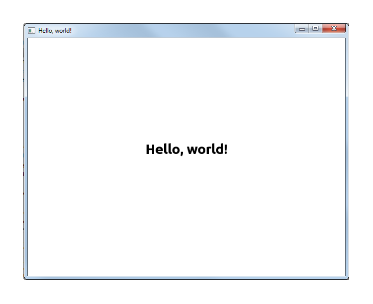
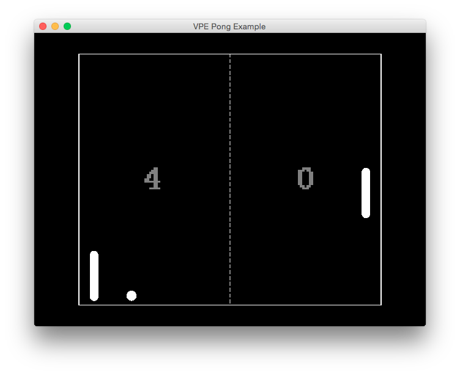
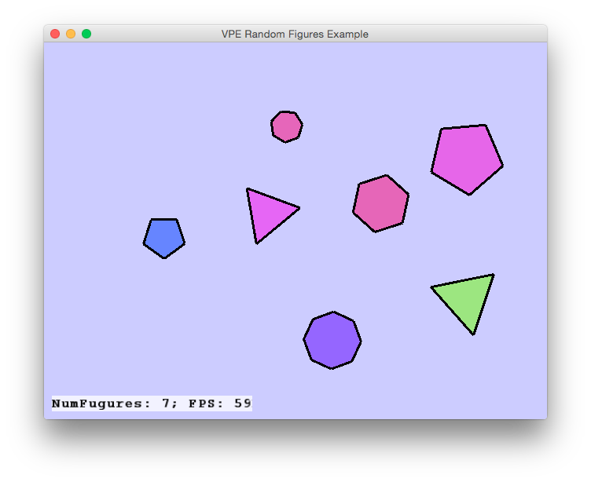
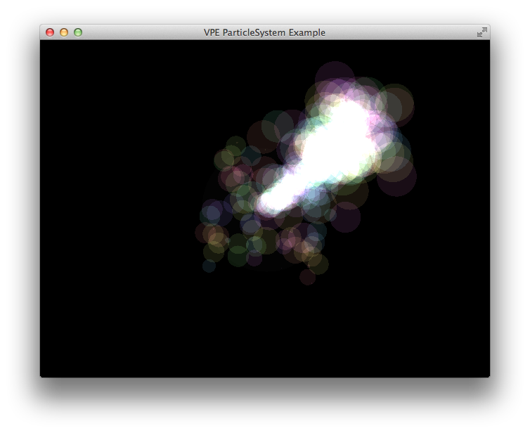

vpe
===

[](https://travis-ci.org/kuviman/vpe)

2D Game Engine for the [D Programming Language](http://dlang.org)

## Requirements

To use `vpe` you need [D compiler](http://dlang.org/download.html) and [Dub package manager](http://code.dlang.org/download)

You also need dynamic libraries:

- [GLFW3](http://www.glfw.org/download.html)
- [SDL2](https://www.libsdl.org/download-2.0.php)
- [SDL2_image](https://www.libsdl.org/projects/SDL_image/)
- [SDL2_ttf](https://www.libsdl.org/projects/SDL_ttf/)

## Installation

```
$ git clone https://github.com/kuviman/vpe.git
$ dub add-local vpe
```

## Documentation

[DDox generated documentation](http://kuviman.github.io/vpe/)

## Usage

Add a depencency to your dub project:
```
"vpe": "~>0.1-alpha"
```

Hello world example:
```
import vpe;
void main() {
	display.title = "Hello, world!";
	while (!gotEvent!Quit) {
		draw.clear(Color.White);
		draw.save();
		draw.plainview();
		draw.color(Color.Black);
		draw.translate(draw.width / 2, draw.height / 2);
		draw.scale(32);
		draw.text("Hello, world!", 0.5);
		draw.load();
		display.flip();
	}
}
```

Also, see `examples/` folder





